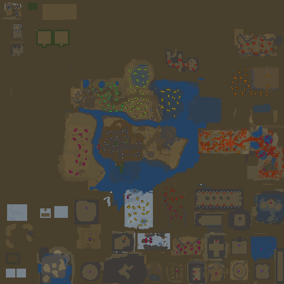

# TWRPG Standalone

A planned standalone reimplementation of **The World RPG (TWRPG)** — the Warcraft III custom
map by Keekero, currently maintained by greenFruit — as a game that runs on its own, without
Warcraft III.

**Status: planning. No code written yet.**

## Read in this order

| Doc | What it covers |
|---|---|
| [`docs/00-RESEARCH-FINDINGS.md`](docs/00-RESEARCH-FINDINGS.md) | What the map is, every system reconstructed from source data, what data we have and what is missing |
| [`docs/01-GAME-DESIGN-SPEC.md`](docs/01-GAME-DESIGN-SPEC.md) | The game to build: scope options, combat model, items, crafting, zones, encounters, the Codex |
| [`docs/02-TECH-PLAN.md`](docs/02-TECH-PLAN.md) | Architecture, engine choice, content pipeline, testing, legal position |
| [`docs/03-ROADMAP.md`](docs/03-ROADMAP.md) | Phased plan, critical path, risks, next actions |
| [`docs/04-EXTRACTED-MAP-DATA.md`](docs/04-EXTRACTED-MAP-DATA.md) | Results of unpacking the real `.w3x`: terrain, object data, spawn coordinates, derived zones |
| [`docs/05-COMBAT-FORMULAS.md`](docs/05-COMBAT-FORMULAS.md) | Recovered EXP curve, armour formula and damage pipeline, from the constants file and deobfuscated script |
| [`docs/06-ABILITY-HANDLER-MAP.md`](docs/06-ABILITY-HANDLER-MAP.md) | Mangled JASS functions mapped back to named abilities via the spell registry |
| [`docs/07-PLATFORM-DECISION.md`](docs/07-PLATFORM-DECISION.md) | Dota 2 custom game vs standalone: effort, cost, and the one blocker that decided it |
| [`docs/08-DOTA2-IMPLEMENTATION-PLAN.md`](docs/08-DOTA2-IMPLEMENTATION-PLAN.md) | **The active build plan** — concept mapping, friction points, revised roadmap |

## Build

```bash
python3 tools/build-content/build.py         # validate + generate the Dota addon content
python3 tools/build-content/test_formulas.py # formula/constants regression tests
python3 tools/build-content/test_systems.py  # systems-layer rule tests
```

Current state — **Phase 1**: the full content set now generates.

| Generated | Count |
|---|---|
| Monsters (`npc_units_custom.txt` + `units.lua`) | 147 (52 bosses) |
| Items (`items.lua`), of which equippable in `npc_items_custom.txt` | 765 / 576 |
| Recipes (`recipes.lua`) | 486 |
| Hero abilities (`npc_abilities_custom.txt` + `abilities.lua`) | 372 (98 sub-menu) |
| Classes (`npc_heroes_custom.txt` + `heroes.lua`) | 37 |
| Gameplay constants (`constants.lua`) | exact XP curve + armour coefficient |
| Buff/debuff slot table (`stacking.lua`) | 30 slots, 16 effect kinds, 99 sources |

Systems layer (`scripts/vscripts/`): `core/damage.lua` (pipeline + armour formula),
`core/stacking.lua` (Type-A/B/C/D slots), `systems/inventory.lua` (24+24 slots, overflow
chain), `systems/crafting.lua` (486-recipe graph, Forge plans), `systems/loot.lua`
(drop rolls, Wish pity, participant-gated chests).

Source validation: 0 errors, 8 warnings. Generated cross-references: all resolve.
Build is byte-reproducible. See [`tools/build-content/README.md`](tools/build-content/README.md).

## Research data

`research/raw/` — the vendored community dataset (read-only):
765 items, 147 monsters, 37 heroes, 372 hero abilities, 280 boss abilities, 486 recipes,
154 builds, and 381 patch changelogs.

`research/extracted/` — data parsed out of the **real map file** (`twrpgv0.65b_eng.w3x`):
1,286 units, 1,292 items, 1,944 abilities, 564 buffs, full 481×481 terrain, and 638 mined
spawn coordinates clustered into 18 labelled zones. Rendered maps in
`research/extracted/maps/`.

> The `.w3x` itself and its script are **not** vendored — they are copyrighted. Only derived
> factual data is kept. Re-extract with the toolchain below.

`tools/extract-w3x/` — a dependency-free MPQ reader and parsers written for this project
(no StormLib, no pip). See [`docs/04-EXTRACTED-MAP-DATA.md`](docs/04-EXTRACTED-MAP-DATA.md) §1.

`research/tables/` — generated human-readable references. Regenerate with:

```bash
python3 research/derive_tables.py
```

| Table | Contents |
|---|---|
| `bosses.md` | 39-boss progression ladder with stats, party caps, drops |
| `zones.md` | 20 zones with level bands and every inhabitant |
| `items.md` | 765 items by grade tier, with recipes and drop rates |
| `heroes.md` | 37 classes with full per-skill tables |
| `crafting.md` | Recipe depth and total farm cost for every craftable item |
| `ability_handlers.md` | Every ability → its obfuscated handler function, bound event, and recovered formulas |

## Headline numbers

37 heroes · 39 bosses (+96 creeps/minions) · 765 items · 486 recipes up to 10 levels deep ·
652 distinct abilities · level cap 100 · 6 item grade tiers · 1–10 player co-op

World: 480×480 cells / 61,440×61,440 units, playable 478×478 — a central continent plus
roughly 60 instanced boss arenas around the perimeter.

Recovered exactly: **EXP curve** `Need(L) = 1650 × 1.05^(L-1) − 1500` (3,951,397 XP to level
100) and **armour mitigation** `damage × 1/(1 + 0.02 × armor)`.



*Terrain rendered from the extracted `war3map.w3e`, with 638 mined spawn points coloured by
level band (green = low, violet = 130).*

## Platform: Dota 2 custom game

**Decided.** Valve hosts the servers, Dota's art library is usable, and the engine is already
authoritative multiplayer — which deletes the three biggest risks in a standalone build. The
project is non-commercial by license, i.e. a tribute port.

The recovered gameplay constants map almost one-for-one onto Dota's custom-game API: the exact
EXP curve installs via `SetCustomXPRequiredToReachNextLevel`, and TWRPG's disabled attribute
bonuses map directly onto `SetCustomAttributeDerivedStatValue`.

Rationale: [`docs/07-PLATFORM-DECISION.md`](docs/07-PLATFORM-DECISION.md) ·
Build plan: [`docs/08-DOTA2-IMPLEMENTATION-PLAN.md`](docs/08-DOTA2-IMPLEMENTATION-PLAN.md)

## Three things to know before planning further

1. **TWRPG has almost no quests.** Progression runs on gated boss summons, recipe completion
   and world-state chains. The plan turns those implicit goals into an explicit Codex —
   see design spec §7.
2. **No original assets can ship.** Art, models, icons and sound are Blizzard and third-party
   IP. Systems and numbers are reimplementable; the art must be original. See tech plan §9.
3. **The community dataset checks out.** Extraction independently matched 765/765 items,
   147/148 bosses and 36/37 heroes. Where the two disagree, the map holds *base* values and
   the script applies runtime scaling — both layers are needed. See doc 04 §8.

## Credits, licensing and takedown

**The World RPG** is the work of **Keekero** (original author) and **greenFruit** (maintainer).
Warcraft III is © Blizzard Entertainment; Dota 2 and Source 2 are © Valve. This is an
unaffiliated, **non-commercial fan tribute** — the Dota Workshop licence is non-commercial by
definition.

The dataset in `research/raw/` comes from [sfarmani/twrpg-info](https://github.com/sfarmani/twrpg-info)
(TWRPG-BOT), with supporting material from [alecpayos/twrpg-guidebook](https://github.com/alecpayos/twrpg-guidebook)
and the [TWRPG Wiki](https://twrpg.miraheze.org/wiki/Main_Page). **Neither upstream repo states
a licence**, so it is mirrored in good faith with attribution, not under any granted right.

The map file, its script and all art/assets are **deliberately not included** — only derived
factual data, reproducible via `tools/extract-w3x/`.

Original work here (docs, tools, generated tables) is MIT — see [`LICENSE`](LICENSE).
Full provenance and a standing takedown offer: **[`NOTICE.md`](NOTICE.md)**.
